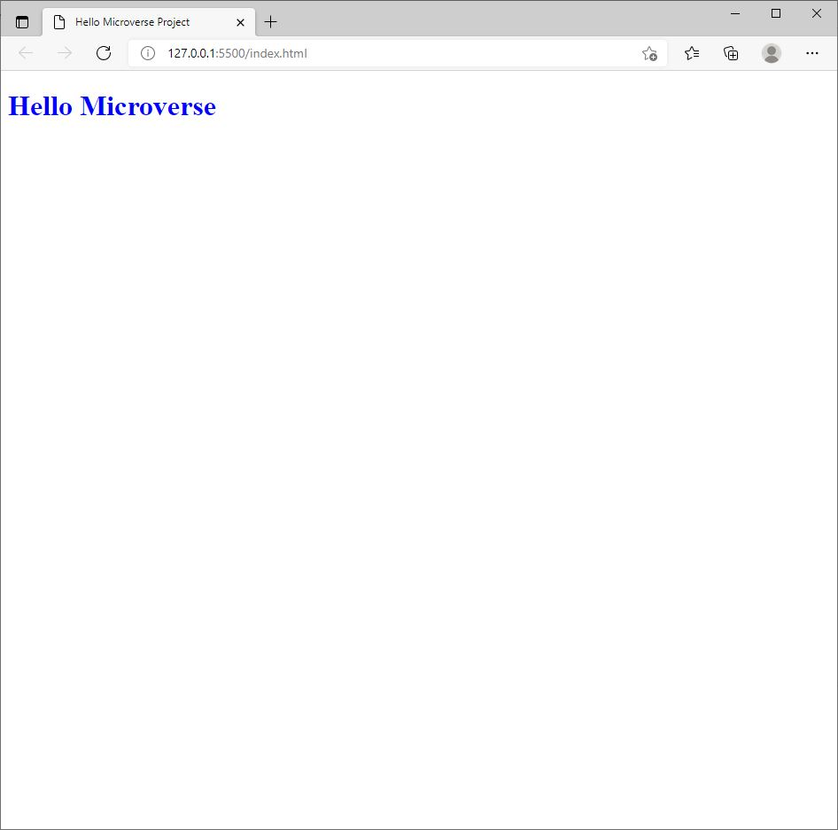

# Hello Microverse Project

> This project is to create and demonstrate the understanding of using linter to debug, fix stylistic errors and how pull request works in microverse.

This project is to create a hello-microverse branch adding html file css file, and test.md file and adding test.md file to .gitignore file. It has a simple web page that contains only a header using css to style the header. It also involves installing linters config file to debug and fix errors.

## Built With

- Html
- Css

##  Prerequisites

- Text editor
- Git
- Html
- Css

## Getting Started

To get a local copy up and running follow these simple example steps.

- You can clone this repo by typing git clone 'https://github.com/Kossi-stack/Hello_Microverse.git' on your terminal
- Type cd 'Hello_Microverse' to access the project on the terminal

## Authors

👤 **Kossi-Stack**

- GitHub: [@githubhandle](https://github.com/Kossi-stack/Hello_Microverse)
- LinkedIn: [LinkedIn](https://www.linkedin.com/in/kossifioklou2406/)

## 🤝 Contributing

Contributions, issues, and feature requests are welcome!

Feel free to check the [issues page](https://github.com/Kossi-stack/Hello_Microverse/issues).

## Show your support

Give a ⭐️ if you like this project!

## 📝 License

This project is [MIT](./MIT.md) licensed.
